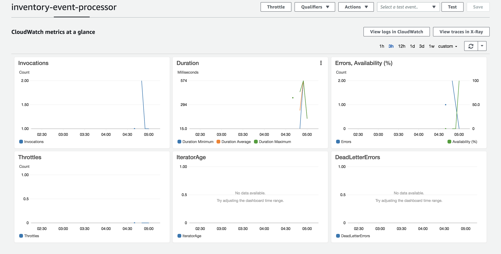

Pre-requisite
--------------

- [install aws-cli](https://docs.aws.amazon.com/cli/latest/userguide/cli-install-macos.html)

```
pip --version #pip install --upgrade pip -> 18.1
curl -O https://bootstrap.pypa.io/get-pip.py
python3 get-pip.py --user
pip3 install awscli --upgrade --user

pip3 list  | grep aws
awscli               1.16.56  

aws --version
```

- add aws user with enough policies
- [configure aws in local machine, or application](https://docs.aws.amazon.com/cli/latest/userguide/cli-chap-getting-started.html)

```
# ~/.aws/credentials

[default]                                                                                                                                              
aws_access_key_id = 
aws_secret_access_key = 
```

```
aws lambda list-functions --profile aws-federated --region us-west-2
```

build artifact
----------------

```
sbt assembly
```

deploy lambda handler
----------------------

create a [Identity Access Role](https://console.aws.amazon.com/iam/home#/roles) with a policy allowing access to Lambda server.
(to be quick, filter policies with lambda and select 14 policies). I will call it `root`, then copy the ARN

```
$ aws lambda delete-function --function-name inventory-event-processor --region us-west-2 --profile aws-default

$ aws lambda create-function --function-name inventory-event-processor --role arn:aws:iam::xxx:role/root --runtime java8 --handler event.handlers.InventoryEventHandler::handleRequest --zip-file fileb://target/scala-2.12/amz-serverless-InventoryResp-assembly-1.0.jar --memory-size 512 --region us-west-2 --profile aws-default
{
    "TracingConfig": {
        "Mode": "PassThrough"
    }, 
    "CodeSha256": "pZ7sOWFUFup1vL2RgnX5OUz2BrtkUOE2l0BbUdF1Nrc=", 
    "FunctionName": "inventory-event-processor", 
    "CodeSize": 5281382, 
    "RevisionId": "7121b65a-ecff-4b17-81e7-443c7ce5883c", 
    "MemorySize": 512, 
    "FunctionArn": "arn:aws:lambda:us-west-2:xxx:function:inventory-event-processor", 
    "Version": "$LATEST", 
    "Role": "arn:aws:iam::xxx:role/root", 
    "Timeout": 3, 
    "LastModified": "2018-11-16T04:36:30.882+0000", 
    "Handler": "event.handlers.InventoryEventHandler::handleRequest", 
    "Runtime": "java8", 
    "Description": ""
}
```

```
$ aws lambda list-functions --profile aws-default --region us-west-2
{
    "Functions": [
        {
            "TracingConfig": {
                "Mode": "PassThrough"
            }, 
            "Version": "$LATEST", 
            "CodeSha256": "pZ7sOWFUFup1vL2RgnX5OUz2BrtkUOE2l0BbUdF1Nrc=", 
            "FunctionName": "inventory-event-processor", 
            "MemorySize": 512, 
            "RevisionId": "7121b65a-ecff-4b17-81e7-443c7ce5883c", 
            "CodeSize": 5281382, 
            "FunctionArn": "arn:aws:lambda:us-west-2:xxx:function:inventory-event-processor", 
            "Handler": "event.handlers.InventoryEventHandler::handleRequest", 
            "Role": "arn:aws:iam::xxx:role/root", 
            "Timeout": 3, 
            "LastModified": "2018-11-16T04:36:30.882+0000", 
            "Runtime": "java8", 
            "Description": ""
        }
    ]
}
```

run the event handler
-------------------------

```
aws lambda invoke --invocation-type RequestResponse --function-name inventory-event-processor --payload '{"item": "shirts", "qty": 100}' --region us-west-2 --profile aws-default output.text
{
    "FunctionError": "Unhandled", 
    "ExecutedVersion": "$LATEST", 
    "StatusCode": 200
}


$ cat output.text 
{"item":"shirts","totalQty":110}
```

Metrics
--------



References
-----------

Also see: https://github.com/prayagupd/amz-servermore

http://docs.aws.amazon.com/lambda/latest/dg/get-started-create-function.html

https://blog.symphonia.io/learning-lambda-part-5-743d8a99db53

https://docs.aws.amazon.com/lambda/latest/dg/java-programming-model-req-resp.html